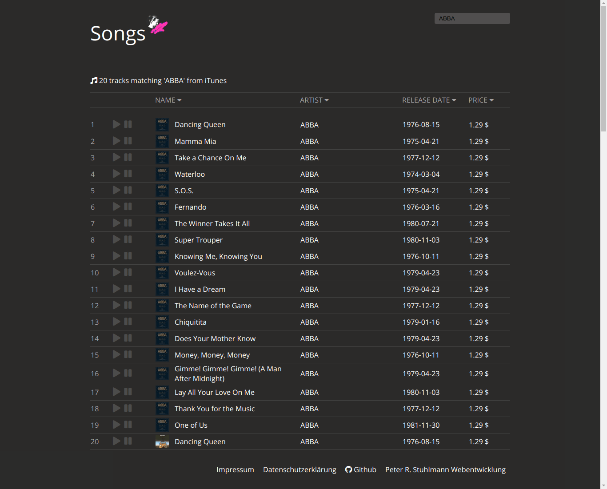

# iTunes API
**- built with REACT -**

    

---

## Screenshot 

This project is based on **React**.   
Here you can find my **Vanilla Javascript** version of this iTunes tracklist: [https://github.com/peter-stuhlmann/iTunes-API](https://github.com/peter-stuhlmann/iTunes-API)

---

## License

Licensed under the [MIT](https://github.com/peter-stuhlmann/iTunes-API-React/blob/master/LICENSE) License.

---

[&copy; Peter R. Stuhlmann Webentwicklung](https://peter-stuhlmann-webentwicklung.de). All rights reserved.